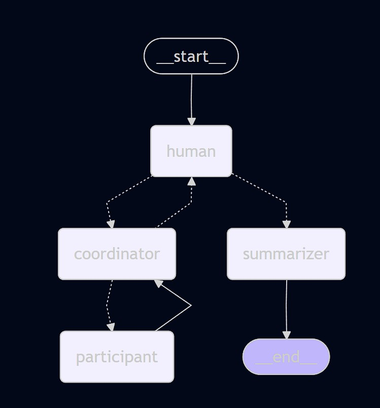

# Assignment 3
### 1. Set up the virutal environment
# Open a terminal (This guide uses the powershell terminal in VS code)
# Navigate to 3-workshop-starter as the root folder
python -m venv .venv
.\.venv\Scripts\Activate.ps1

### 2. Install packages and prepare environment variables
# Create a copy of .env_template and rename it to just .env
# Replace the necessary api keys in the .env file
uv sync

### 3. Running the application
```sh
uv run python main.py
```

### Dependencies
- Python
- OpenAI
- Langchain

## Scenario
The multi-agents system aims to simulate

"***A forum-like discussion between members from different age groups regarding a phenomenon that is occurring in Singapore.***"

## Implementation

### 1. Agents

#### 1.1. Person
The agents are depicted as persons from 3 different age groups engaging in a forum-like discussion regarding a phenomenon that is happening in Singapore.
- Each actor will attempt to identify the cause(s) and provide solution(s) based on their life experience(s) and accessible current affairs.
- Each actor will also rebut / agree with the cause(s) / solution(s) shared by the other actors.

##### 1.1.1. Student
The student is the youngest of the age groups. Their main concerns consist of managing schoolwork, finding out their passion and exploring the world.

1.1.1.1. **Sarin Chew**
A senior secondary school student. Young and Naive that enjoys hanging out with their friends. Starting to gain interest in the political, social and economic status of their country.

1.1.1.2. **Tommy Queck**
A university freshman. Tired from adapting to university but still eager to learn. Thier main concerns are with regards to their future choice of either pursuing their dream or stability


##### 1.1.2. Working Adult
The working adult is the middle of the age groups. Their main concerns consist of managing costs of living, having a career and also managing a family.

1.1.2.1. **Aiden Tan (Age 30)**

Process Integration Engineer at a semiconductor fab”, very curious, weekend tinkerer, very chatty, Understands Singapore-specific concerns like CPF, HDB, NS obligations, and Singlish nuances.

##### 1.1.3. Retiree
The retiree is the oldest of the age groups. Their main concerns consist of managing health issues that arise from old age, medical costs and having a comfortable nest to live the rest of their live.

1.1.3.1. **Joseph Tay (Age 70)** 

Ex-laywer who has retireed about 5 years. He has a wife who suffers from dementia and no children.

#### 1.2. Summarizer
Agent that will summarize the highlighted cause(s) for the phenomenon and the potential solution(s) from the discussion held by the person agents 
  
#### 1.3. Coordinator
Agent that will facilitate and coordinate the discussion held by the person agents.
- Enures that every speaker should have spoken at least once.
- Check who has not spoken recently.
- Decide on which person agent is contributing varying viewpoints / interesting viewpoints.
- Make it a discussion between the person agents.

### 2. Tools
2.1. **News**

Provides information about the latest news that is happening in Singapore from wiki and feed.

2.2. **Weather**

Provides information about weather conditions that has / will occur in Singapore.

2.3. **Time**

Provides the current time and zone of Singapore.

### 3. States
In order for the person agents to have a meaningful discussion, the speaking person agent must know what was previously discussed. 

Additionally, the coordinator must be able to identify who to speak and when to stop assigning agents to speak and end the discussion.

Hence, each state consists of the following basic information:

- List of messages that was discussed previously.
- The number of conversations left before stopping the discussion.
- The person agent assigned to speak.

### 4. Nodes
To simulate the different agents communicating in order with reference to its state, different nodes have to be created and linked together in the required workflow.

4.1. **Human Node**

Responsible for starting the discussion by giving a phenomenon that is happening in the context of Singapore / ending the entire discussion.

4.2. **Coordinator Node**

Responsible for selecting the next participant to speak / asking the human node for feedback after 5 discussions between the participants.

4.3. **Participant Node**

Responsible for emulating the given persona and providing insights to the highlighted phenomenon with consideration to what was previously discussed.

4.4. **Summarizer Node**

Responsible for summarizing all the messages that were discussed and providing the main element of the topics discussed by each of the participant.

### 5. Graph
The multi-agentic system consists of the different nodes communicating together to form the entire workflow.

# Summary

A concise read of a multi-generational Singapore forum thread on cost of living, care, and education.

- Key topics discussed
  - Cost of living in Singapore: housing, healthcare, long-term care, and daily expenses.
  - Stress and impact on retirement, especially for those caring for spouses with dementia.
  - Education costs: tuition, scholarships, grants, bursaries, and uni pathways.
  - Practical needs: stronger long-term care support, affordable housing, CPF/medical buffers, and mental-health assistance.
  - Transportation as a relative bright spot (reliable trains), contrasted with other pressures.

- Dynamics between participants
  - Intergenerational perspectives: older poster (You) sets a broad question; Joseph Tay offers an elder-care viewpoint; Aiden Tan responds with empathy and practical needs; Sarin Chew provides a youth/student perspective with concerns about uni and family costs.
  - Supportive yet urgent tone: participants acknowledge each other’s worries and offer resources or ideas.
  - Concrete calls to action: requests for policy fixes (grants, buffers, housing), and practical tips or links for scholarships.

- Memorable quotes / highlights
  - “The trains are reliable; everything else seems intent on diminishing one’s patience and savings.” — Joseph Tay
  - “Wah, I really feel you lah — trains steady also cannot pay for caregiving and medical bills…” — Aiden Tan
  - “Wah, seeing Gong Cha and Style Theory close and so many budget options disappearing really scares me…” — Sarin Chew
  - “sibeh stressed sia — how can I even think about saving for uni or helping my parents when everything kena more expensive?” — Sarin Chew

- Overall mood and flow
  - Anxious but collaborative: generations unite in recognizing financial pressures while seeking practical support and ideas.
  - Flow moves from general concern to specific needs (care, housing, grants, scholarships, mental health) with a readiness to share resources and discuss policy fixes.

Overall takeaway
- The thread captures a shared anxiety about rising costs across age groups, highlighting gaps in long-term care, housing affordability, and student support, while underscoring a community willingness to discuss solutions and help one another.# Summary

Forum Summary: Traction Inverter Delay at Singapore Station

Overview
- Technical delay: Traction inverter replacement started, but an unexpected compatibility/test fault on the replacement unit is delaying recovery. New ETA: about 21:00. Frequent updates promised.
- Operational response: Crowd-control and passenger-flow measures activated by station staff, including directing passengers to the covered bus stop, taxi fallback, gate adjustments, and potential pause of ticketing. Medical on standby.

Key topics discussed
- Technical issue: Inverter fault during replacement and its impact on restoration timing.
- updated ETA and communication: Ongoing updates planned to keep passengers informed.
- Crowd management plan: Gate adjustments, cover bus-stop guidance, taxi fallback, temporary pause on ticketing to regulate flow.
- Safety readiness: Medical escalation prepared if needs arise.

Participants and dynamics
- Engineering: Leading the technical fault assessment and replacement work.
- Station staff: Implementing crowd-control measures and guiding passengers.
- Action owner: StationMaster coordinating the response and communications.
- Dynamic: Collaborative, task-focused, with emphasis on timely updates and safety.

Memorable quotes / highlights
- “New ETA ~21:00”
- “Direct passengers to the covered bus stop (taxi fallback)”
- “Pause ticketing as needed to regulate crowd”
- “Medical on standby if required”
- Weather note: “Singapore weather: showers with thunder, 28-32°C, humid.”

Mood and flow
- Urgent but orderly: A disrupted service scenario managed through clear roles, proactive guidance, and staged updates.
- Tone: Calm, procedural, with emphasis on safety and passenger convenience despite the delay.